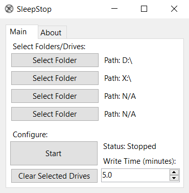
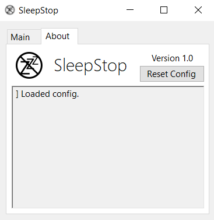

#  SleepStop
Prevents HDDs from sleeping by writing an empty file every few minutes.

## Info
- Currently allows for up to 4 path selections (can include different directories on the same drive).
- Automatically saves write paths and write time to a config file at %appdata%/SleepStop.
- File written is named "sleepStopWriteFile.sleepstopwritefile". Any file named that WILL be deleted/overwritten.
- The program may freeze for a while when pressing start due to the drive needing to spin up. It should unfreeze after a few seconds.

## Preview
 
